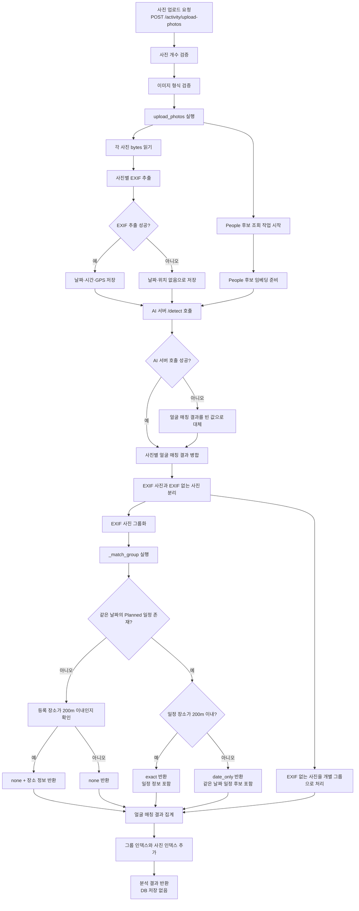

# 현재 사진 업로드 및 일정 매칭 흐름

## 문서 목적

이 문서는 현재 Cluster 백엔드의 사진 업로드 분석 흐름을 기록한다.
개선된 구조가 아니라, 현재 코드가 실제로 수행하는 순서와 결과를 이해하기 위한 기준 문서다.

주요 진입점은 `POST /activity/upload-photos`이며, 핵심 서비스 함수는 `upload_photos()`다.

## 전체 흐름



## 현재 일정 매칭 규칙

`_match_group()`은 사진 그룹의 첫 번째 사진을 대표 사진으로 사용한다.

| 조건 | 결과 |
| --- | --- |
| 같은 사용자의 `Planned` 일정이 없음 | `none` |
| 같은 날짜이고 일정 장소가 사진 위치 200m 이내 | `exact` |
| 같은 날짜지만 일정 장소가 사진 위치 200m 초과 | `date_only` |

현재 일정 매칭의 핵심 판단 기준은 다음과 같다.

```text
사진 그룹 대표 사진의 날짜 + 일정 날짜
사진 그룹 대표 사진의 GPS + 일정 장소 GPS
```

일정의 시간과 참여 인물은 현재 `exact` 여부를 결정하는 조건으로 사용되지 않는다.
`date_only` 결과에서는 같은 날짜의 일정 후보 정보에 포함된다.

## 단계별 책임

| 단계 | 함수 또는 위치 | 책임 |
| --- | --- | --- |
| 요청 진입 | `activity/api.py`의 `upload_photos_route()` | 사진 개수·이미지 검증, 서비스 호출 |
| 분석 orchestration | `activity/service.py`의 `upload_photos()` | EXIF, AI 결과, 그룹화, 매칭 결과 조합 |
| 임베딩 후보 준비 | `_get_people_candidates()` | 사용자의 People 후보와 임베딩 준비 |
| 사진 그룹화 | `_group_photos()` | 날짜·GPS·시간 기준으로 사진 그룹 생성 |
| 일정 매칭 | `_match_group()` | 사진 그룹과 기존 일정 후보 비교 |
| 결과 반환 | `upload_photos()` | 그룹별 분석 결과와 얼굴 매칭 결과 반환 |

## 현재 데이터 저장 경계

사진 업로드 분석 단계에서는 일정이나 활동 로그를 DB에 저장하지 않는다.

```text
upload_photos
→ 분석 결과 반환
→ 사용자가 일정 선택
→ confirm_schedule
→ ActivityLog 생성
```

따라서 이 문서는 사진 업로드부터 분석 결과 반환까지의 흐름만 다루며,
활동 확정과 `ActivityLog` 생성은 별도 흐름으로 분리한다.
